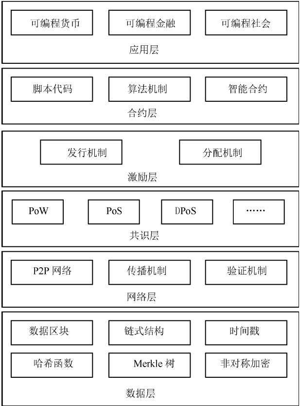

基本框架
========

数据层
------

#. 数据区块
#. 链式结构
#. 时间戳
#. 哈希函数
#. Merkle树
#. 非对称加密

网络层
------

#. P2P 网络 
#. 传播机制
#. 验证机制

共识层
------

#. PoW
#. PoS 拜占庭将军问题，采用投票的方式，只有在所有将军和副官达成共识的情况下，才能攻打故人。 ，如权益证明机制（Proof of Stake，POS）、 股份授权证明机制（Degate Proof of Stake，DPOS）等。 权益证明机制通过每一笔交易销毁的币天数（Coin Days）①实现权益证明，从而克服了工作量证明机 制浪费算力的问题。股份授权证明机制则是通过实施科技式民主来抵消中心化的影响：由拥有投票权 的人投票选出区块链的生产者签署（生产）区块； 在每个区块被签署之前，要验证前一个区块已经被 受信任节点签署 PoS 是通过持有进行增持的。
#. DPoS

激劢层
------

让区块链与各个行业结合，其实是发掘其本质的过程。

#. 发行机制
#. 分配机制

合约层
------

#. 脚本代码
#. 算法机制
#. 智能合约

应用层
------

#. 可编程货币
#. 可编程金融
#. 可编程社会
